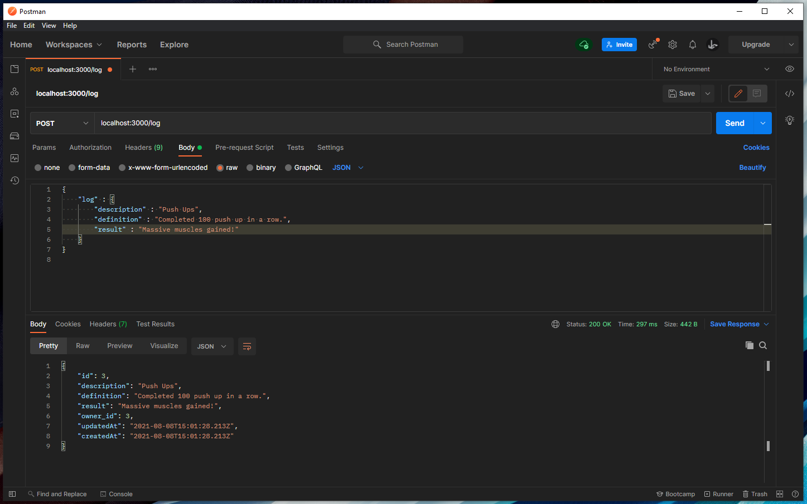

# Workout Logbook Server Build

This repo is my first build of a server on my own after learning the step by step process taught to me by the cirriculum at Eleven Fifty Academy.

Below are screenshots of all my working endpoints.

Registering a User

Loginin - SUCCESS

Login - FAIL

Create a log - SUCCESS

Create a log - FAIL

Get all logs by individual user

Get individual logs by id for an individual user

Update a log

Delete a log

## Create your folders

- Middleware
- Controllers
- Models

## Create files

- app.js
- db.js
- .env
- .gitignore

## Build As needed

- user controller
- log controller
- validate session
